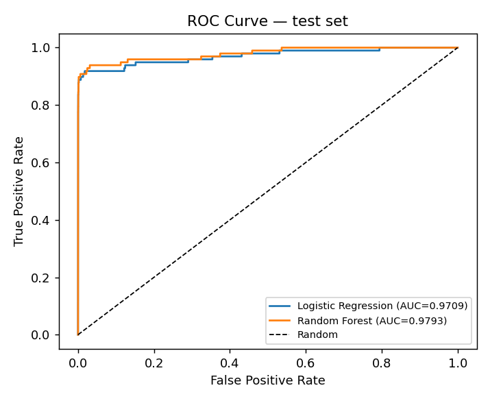
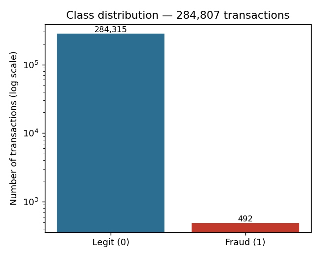

# Credit Card Fraud Detection

A machine learning pipeline that flags fraudulent credit card transactions in a heavily imbalanced, real-world dataset — end to end, from raw data to evaluated models.

## Dataset

[Kaggle — Credit Card Fraud Detection](https://www.kaggle.com/datasets/mlg-ulb/creditcardfraud): 284,807 real, anonymized transactions made by European cardholders in September 2013, with 492 confirmed frauds (0.173% of all transactions — roughly 1 fraud per 578 legitimate transactions). Features `V1`–`V28` are PCA components of the original transaction data (anonymized for confidentiality reasons by the data provider); `Time` and `Amount` are the only two untransformed columns. Originally released for research by the [Machine Learning Group at ULB](http://mlg.ulb.ac.be) (Université Libre de Bruxelles).

The raw CSV (~98 MB) isn't committed to this repo — see [Setup](#setup) below for how to get it.

## What this does

- Explores the class imbalance and why plain accuracy is a misleading metric here
- Balances the **training set only** using SMOTE (Synthetic Minority Over-sampling Technique), implemented from scratch in [`src/smote.py`](src/smote.py) using `sklearn.neighbors.NearestNeighbors` — no `imbalanced-learn` dependency
- Trains and compares Logistic Regression and Random Forest classifiers
- Evaluates every model on the **untouched, still-imbalanced** test set using Precision, Recall, F1-Score, and ROC-AUC
- Compares against a Random Forest trained without SMOTE, to make the actual precision/recall trade-off visible instead of assumed

## Results

| Model | Precision | Recall | F1-Score | ROC-AUC |
|---|---|---|---|---|
| Logistic Regression (SMOTE) | 0.0574 | 0.9184 | 0.1081 | 0.9709 |
| Random Forest (SMOTE) | 0.6434 | 0.8469 | 0.7313 | 0.9793 |
| Random Forest (no SMOTE, baseline) | 0.9412 | 0.8163 | 0.8743 | 0.9752 |

Random Forest trained on SMOTE-balanced data gives the best overall F1. The no-SMOTE baseline trades recall for much higher precision — which model is "better" depends on whether the deployment context weighs false positives (wasted manual review) or false negatives (missed fraud) more heavily.




More plots (confusion matrices, feature importance) are in [`results/`](results/), and the full walkthrough with all outputs already rendered is in [`notebook.ipynb`](notebook.ipynb) — viewable directly on GitHub, no need to run anything.

## Project structure

```
├── notebook.ipynb          # full walkthrough, outputs pre-rendered
├── src/
│   ├── train.py             # end-to-end training/eval script
│   └── smote.py              # from-scratch SMOTE implementation
├── results/                 # saved metrics + plots from the last run
│   ├── metrics.json
│   ├── metrics.md
│   └── *.png
├── data/
│   └── download_data.md      # how to get the dataset
└── requirements.txt
```

## Setup

```bash
git clone https://github.com/<your-username>/credit-card-fraud-detection.git
cd credit-card-fraud-detection
pip install -r requirements.txt
```

Download `creditcard.csv` from [Kaggle](https://www.kaggle.com/datasets/mlg-ulb/creditcardfraud) (requires a free Kaggle account) and place it at `data/creditcard.csv` — see [`data/download_data.md`](data/download_data.md) for exact steps.

Then run:

```bash
python src/train.py
```

This regenerates everything under `results/`.

## Tech stack

Python, pandas, NumPy, scikit-learn, matplotlib.

## Author

Ravi Kumar — MCA, National Institute of Technology Karnataka, Surathkal.
